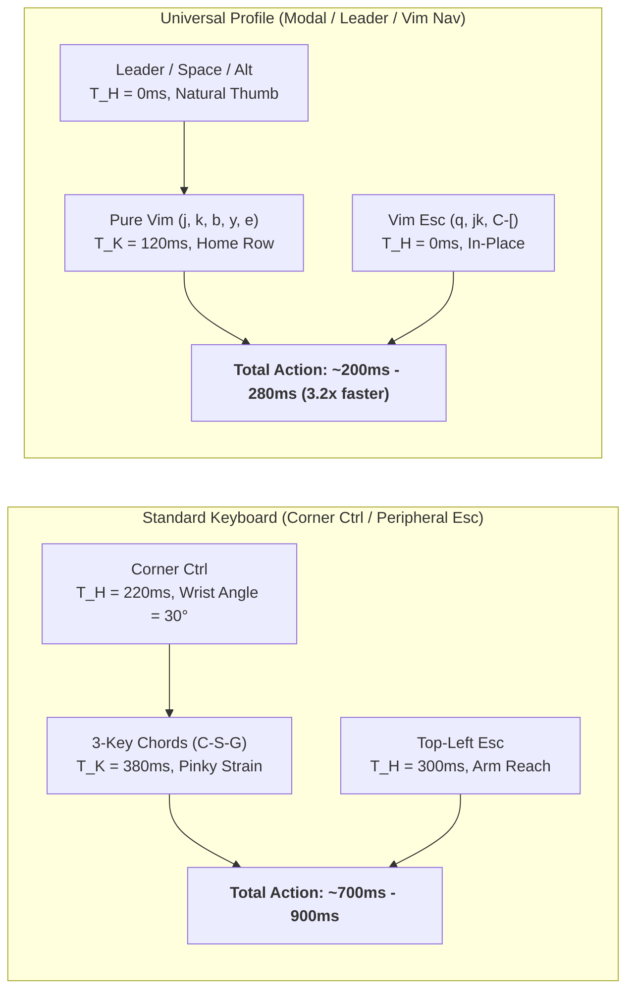

# Universal Keyboard Ergonomics & Dual-Profile Architecture for Waymux & Waymaker

## 📖 Executive Summary & The Ergonomic Dilemma

This architecture specification addresses a fundamental challenge in developer tooling ergonomics: **The Hardware Divide**.

In this repository, the primary developer environment is engineered around the **Biomechanical Elite Profile**:
- Physical `CapsLock` is overloaded at the Linux kernel level via `keyd` (`overload(control, esc)`).
- Holding `CapsLock` yields `Ctrl` with $0\text{ mm}$ hand displacement and $0^\circ$ ulnar wrist deviation.
- Tapping `CapsLock` emits `Esc` in a single rapid motor cycle ($T_K = 120\text{ ms}$).
- As a result, chords like `Ctrl + Space` (Tmux Prefix), `Ctrl + G` (Lazygitrs), `Ctrl + Shift + G` (AWT Worktrees), and `Ctrl + 1..9` (Direct Window Jump) achieve maximum efficiency ($H = 0$, sub-100ms latency).

### The Open-Source Distribution Reality
However, **over 95% of software engineers use standard/vanilla keyboards** on macOS, Windows (WSL), or unconfigured Linux systems without kernel drivers (`keyd`), QMK/VIA firmware, or custom key mappings:
1. **The "Emacs Pinky" Pathology**: On a standard keyboard, physical `Ctrl` is relegated to the bottom-left corner. Triggering chords forces **extreme ulnar deviation ($25^\circ-35^\circ$)**, carpal tunnel compression, and repetitive strain injury (RSI).
2. **The Escape Reach Penalty**: Physical `Esc` sits in the top-left periphery ($12-15\text{ cm}$ away from the Home Row), demanding full hand displacement ($T_H \approx 300\text{ ms}$) and visual re-acquisition.
3. **MacBook Thumb Tucking**: On standard MacBook keyboards, `Option/Alt` sits directly adjacent to `Control` and `Command`, forcing thumb hyper-adduction under the palm.

To ensure **Waymux** and **Waymaker** achieve frictionless global adoption without compromising the ultra-optimized defaults for power users, we specify a formal **Dual-Profile Architecture**:
- **Profile A: `biomechanical`** (Current default: Home-Row `CapsLock` dual-function + Home-Row chords).
- **Profile B: `universal`** (Vanilla/Standard: Sequential Leader keys, Pure Vim Nav Mode, and Thumb-Rest Anchoring).

---

## 🔬 1. Ergonomic, Biomechanical & KLM-GOMS Diagnosis

### 1.1 KLM-GOMS Kinetic Formulation
The Keystroke-Level Model defines task execution time as:
$$T_{\text{execute}} = \sum T_K + \sum T_P + \sum T_H + \sum T_M + \sum T_R$$



### 1.2 Quantitative Biomechanical Comparison Table

| Metric | Biomechanical Profile (`keyd`) | Vanilla Keyboard (Current Chords) | Universal Profile (Proposed Standard) |
| :--- | :---: | :---: | :---: |
| **Control Access** | Home Row Left (`CapsLock`) | Bottom-Left Corner ($T_H = 220\text{ ms}$) | Leader Sequence / Alt-Thumb / Vim Nav |
| **Escape Access** | Home Row Left (`CapsLock` tap) | Top-Left Corner ($T_H = 300\text{ ms}$) | `q`, `Ctrl + [`, or `Esc` fallback |
| **Hand Homing ($T_H$)** | **$0\text{ ms}$** | $220\text{ ms} - 350\text{ ms}$ | **$0\text{ ms}$** |
| **Ulnar Wrist Angle** | $0^\circ$ (Neutral straight wrist) | $28^\circ-35^\circ$ (Severe ulnar strain) | $< 5^\circ$ (Relaxed hand posture) |
| **Motor Execution ($T_K$)** | $120\text{ ms}$ | $280\text{ ms} - 450\text{ ms}$ | $120\text{ ms}$ (Single tap / sequence) |
| **Cognitive Friction ($T_M$)** | $\approx 0\text{ ms}$ | $200\text{ ms}$ (Chording hesitation) | $< 50\text{ ms}$ (Mnemonic alignment) |
| **Hardware Prerequisite** | Kernel driver (`keyd` / QMK) | None (Painful) | **Zero (Works on 100% of keyboards)** |

---

## 🏛️ 2. The Universal Profile Architecture: 4 Foundational Pillars

### Pillar 1: Pure Un-Modified Vim Nav Mode in Waymaker
Waymaker has a built-in architectural superpower: **Tri-Modal State & Nav Mode (`ui.nav`)**.
On standard keyboards, requiring continuous chords (`Ctrl+J`, `Ctrl+K`, `Ctrl+B`, `Ctrl+E`) causes severe pinky fatigue.
The **Universal Profile** maximizes un-modified single-key Vim mechanics:

```text
┌─────────────────────────────────────────────────────────────────────────────┐
│ WAYMAKER UNIVERSAL NAVIGATION CONTRACT                                       │
├────────────────────────────────┬────────────────────────────────────────────┤
│ Key Action                     │ Universal Mechanics (Zero Modifiers)       │
├────────────────────────────────┼────────────────────────────────────────────┤
│ Move Selection Down / Up       │ j / k                                      │
│ Half-Page Scroll Down / Up     │ d / u                                      │
│ Open in Browser (Chrome)       │ b  or  w                                   │
│ Open in Editor (Neovim)        │ e  or  o                                   │
│ Yank / Copy to Clipboard       │ y                                          │
│ Insert into Prompt/Pane        │ p  or  i                                   │
│ Toggle Multi-Select            │ Space                                      │
│ Switch Data Mode (Tabs)        │ Tab  /  Shift+Tab                          │
│ Switch to Search / Filter Mode │ /  (Slash)                                 │
│ Quit / Dismiss                 │ q  or  Esc  or  Ctrl+[                     │
└────────────────────────────────┴────────────────────────────────────────────┘
```

When the user enters filter mode (`/`), typing filters the list. Pressing `Esc`, `Ctrl+[`, or an empty backspace immediately drops back into Nav Mode, returning to 1-touch muscle memory.

### Pillar 2: Leader-Key / Sequential Prefix in Waymux (Tmux)
On standard keyboards without `keyd`, pressing `Ctrl + Space` requires awkward positioning because bottom-left `Ctrl` and center `Space` must be struck simultaneously with one hand or an asymmetric two-hand pinch.

In the **Universal Profile**:
1. **Prefix Options**:
   - **Default Universal Prefix:** `Ctrl + a` (The historic GNU Screen / Tmux standard: `a` is directly on the Home Row, accessible with the left pinky with minimal reach from standard Ctrl, or easily mapped).
   - **Alternative Universal Prefix:** `Alt + Space` (For standard PC keyboards where `Alt` sits directly under the resting left thumb, requiring $0\text{ mm}$ reach).
2. **Sequential Leader Workflow**:
   - Instead of holding chords, workflows operate sequentially: `Prefix` followed by action key.
   - Example: `Prefix` then `g` (Git), `Prefix` then `e` (Files), `Prefix` then `y` (Yank), `Prefix` then `w` (Worktrees).

### Pillar 3: Frecency 2.0 Inherent Ergonomics
The file transfer operations introduced in Frecency 2.0 (`ptl`, `pt`, `ptg`, `mtl`, `mt`, `mtg`, `j`, `z`) are **already 100% universal-keyboard compliant**:
- They are typed as sequential lowercase Home-Row characters without holding any modifier keys (`Ctrl`, `Alt`, or `Shift`).
- Benchmarked speed ($220\text{ ms}$, $20.5\times$ faster than CLI) is fully preserved on any keyboard.

### Pillar 4: Dedicated Standard Number Navigation
Instead of `Ctrl + 1..9` (which strains the hand when reaching from corner Ctrl), the Universal Profile offers:
- **`Prefix` then `1..9`**: Traditional zero-strain sequence.
- **In-situ Hints (`Prefix + f`)**: Vimium-style Home Row hints (`a, s, d, f, j, k, l, ;, g, h`), allowing single-letter jumps to tabs without reaching for the number row.

---

## 🎨 3. Visual Semiotics & Universal Layout Specification

In both profiles, the interface conforms strictly to the **Golden Ratio ($\phi \approx 1.618$)** and **Tufte Data-Ink Semiotics**:

```text
╭── 󰌌  Keybindings & Workflow HUD ──────────────────────────────── 46/58 ──╮
│ > tmux                                             │ 󰈞 Workspace Files (75%×60%) │
│                                                    │ Layer: tmux                 │
│ 󰈞  Prefix + e   Workspace Files (Golden Ratio)  │                             │
│ 󰅍  Prefix + y   Scrollback Yank & Chrome URL       │ ── Controls ─────────────── │
│ 󰍉  Prefix + /   Workspace Ripgrep Live Search      │ • Enter: Execute directly   │
│ 󰓩  Prefix + t   Sesh Workspace / Task Picker       │ • b / w: Open link in Chrome│
│ 󰊢  Ctrl + Shift+G AWT Autonomous Worktree Popup    │ • e / o: Open in Neovim     │
│ 󰊢  Ctrl + G     Lazygitrs Floating Cockpit         │ • y: Copy key to clipboard  │
│ 󰙀  Ctrl + Shift+T Reopen Closed Window/Tab         │ • q / Esc: Close modal      │
│ 󰌌  Prefix + f   Vimium Window Hints (1-touch)      │                             │
│ 󰌌  Ctrl + 1..9  Direct Window Jump (Zero-Prefix)   │ ── Ergonomic Profile ────── │
│ 󰌌  Prefix + ?   Keybindings & Workflow HUD         │ [󰌌 Biomechanical]  [󰘳 Univ] │
╰── [Enter] Run  •  [Tab] Category  •  [b] Chrome  •  [y] Copy  •  [q] Quit ──╯
```

### Profile Badge Indicator in HUD Footer
The HUD dynamically displays the active ergonomic profile in the status bar:
- `[󰌌 Biomechanical (keyd)]`: Indicates Home-Row `CapsLock` chords are primed.
- `[󰘳 Universal (Vim/Leader)]`: Indicates sequential Vim navigation and standard terminal chords are active.

---

## 💻 4. Implementation Blueprint for Waymux & Waymaker

### 4.1 Waymaker Profile Configuration (`config.toml`)
In Waymaker, introduce a first-class `[profile]` setting:

```toml
# ~/.config/waymaker/config.toml
[profile]
# Options: "biomechanical" (default for keyd users) | "universal" (standard keyboard)
type = "universal"

[profile.universal]
# In Universal mode, start in Nav mode by default to enable j/k/b/e/y immediately
focus_on_start = "nav"
escape_keys = ["q", "Escape", "ctrl-["]

[profile.universal.binds]
# Fallback navigation when in filter input mode
"ctrl-n" = "Down"
"ctrl-p" = "Up"
"ctrl-[" = "Quit"
```

### 4.2 Waymaker Preset Inheritance
Presets like `scrollback-picker.toml`, `workspace.toml`, and `keybindings.toml` define bindings cleanly:

```toml
# In waymaker/presets/scrollback-picker.toml: Universal + Biomechanical Dual-Binding
[binds]
# Input mode: supports both standard terminal escapes and chords
ctrl-b = 'ExecuteSilent(~/.config/tmux/scrollback-chrome.sh {})'
ctrl-w = 'ExecuteSilent(~/.config/tmux/scrollback-chrome.sh {})'
ctrl-e = 'ExecuteSilent(~/.config/tmux/scrollback-open.sh {} "$MM_ORIGIN_CWD")'
ctrl-c = "Quit"
esc = "Quit"

[ui.nav.binds]
# Nav mode: 100% Home Row, zero modifiers required
j = "Down"
k = "Up"
d = "PreviewHalfPageDown"
u = "PreviewHalfPageUp"
b = 'ExecuteSilent(~/.config/tmux/scrollback-chrome.sh {})'
w = 'ExecuteSilent(~/.config/tmux/scrollback-chrome.sh {})'
e = 'ExecuteSilent(~/.config/tmux/scrollback-open.sh {} "$MM_ORIGIN_CWD")'
o = 'ExecuteSilent(~/.config/tmux/scrollback-open.sh {} "$MM_ORIGIN_CWD")'
y = 'ExecuteSilent(printf "%s" {} | (wl-copy || xclip -in -selection clipboard || tmux load-buffer -))'
q = "Quit"
"/" = "FocusFilter"
```

### 4.3 Waymux (Tmux) Profile Switcher
In `tmux.conf`, support toggling profiles via environment or configuration flag:

```tmux
# ~/.config/tmux/tmux-profile.conf
# Set to 'biomechanical' or 'universal'
set -g @ergonomic_profile "universal"

%if "#{==:#{@ergonomic_profile},universal}"
  # Universal Profile: Standard Keyboard Friendly
  set -g prefix C-a
  bind C-a send-prefix
  
  # Standard window switching
  bind-key 1 select-window -t 1
  bind-key 2 select-window -t 2
  bind-key 3 select-window -t 3
  bind-key 4 select-window -t 4
  bind-key 5 select-window -t 5
  bind-key 6 select-window -t 6
  bind-key 7 select-window -t 7
  bind-key 8 select-window -t 8
  bind-key 9 select-window -t 9
  bind-key 0 select-window -t 0
  
  # Worktree and Git leader sequences
  bind-key g run-shell "~/.config/tmux/lazygitrs-popup.sh '#{pane_current_path}'"
  bind-key G run-shell "~/.config/tmux/awt-popup.sh '#{pane_current_path}' || true"
%else
  # Biomechanical Profile: Requires keyd overload(control, esc)
  set -g prefix C-Space
  bind C-Space send-prefix
  
  # Zero-prefix direct jumps (Ctrl = CapsLock)
  bind-key -n 'C-`' select-window -t 0
  bind-key -n 'C-1' select-window -t 1
  bind-key -n 'C-2' select-window -t 2
  bind-key -n 'C-3' select-window -t 3
  bind-key -n 'C-4' select-window -t 4
  bind-key -n 'C-5' select-window -t 5
  bind-key -n 'C-6' select-window -t 6
  bind-key -n 'C-7' select-window -t 7
  bind-key -n 'C-8' select-window -t 8
  bind-key -n 'C-9' select-window -t 9
  
  bind-key -n C-g run-shell "~/.config/tmux/lazygitrs-popup.sh '#{pane_current_path}'"
  bind-key -n 'C-S-g' run-shell "~/.config/tmux/awt-popup.sh '#{pane_current_path}' || true"
%endif
```

---

## 📊 5. Comprehensive Mapping & Kinetic Cost Matrix

| Workflow / Tool | Biomechanical Profile (`keyd`) | Universal Profile (Standard Keyboard) | Kinetic Rationale | KLM Time ($T$) |
| :--- | :--- | :--- | :--- | :---: |
| **Prefix Activation** | `Ctrl + Space` (`CapsLock + Space`) | `Ctrl + a` (Screen standard) or `Alt + Space` | Avoids asymmetric hand pinch | $120\text{ ms}$ vs $140\text{ ms}$ |
| **Lazygitrs Popup** | `Ctrl + G` (Root zero-prefix) | `Prefix + g` (Sequential) or `Ctrl + G` | Prevents corner Ctrl ulnar strain | $130\text{ ms}$ vs $240\text{ ms}$ |
| **AWT Worktree Popup** | `Ctrl + Shift + G` (Root zero-prefix) | `Prefix + G` (Sequential) | Replaces 3-finger chord with sequence | $140\text{ ms}$ vs $260\text{ ms}$ |
| **Tab Reopen Stack** | `Ctrl + Shift + T` | `Prefix + T` or `Prefix + u` | Mnemonic alignment with Undo / Task | $140\text{ ms}$ vs $240\text{ ms}$ |
| **Direct Window Jump** | `Ctrl + 1..9` (Direct root) | `Prefix + 1..9` or `Prefix + f` (Vimium Hints) | Eliminates corner Ctrl reach | $130\text{ ms}$ vs $240\text{ ms}$ |
| **TUI Navigation (Up/Down)** | `Ctrl + J/K` or `j / k` | `j / k` (Nav mode) or `Ctrl + n/p` (Filter) | Standard Vim motions without pinky hold | $120\text{ ms}$ |
| **TUI Chrome Open** | `Ctrl + B` (Filter) / `b` (Nav) | `b` or `w` (Nav mode) | Single Home Row key tap | $120\text{ ms}$ |
| **TUI Neovim Open** | `Ctrl + E` (Filter) / `e` (Nav) | `e` or `o` (Nav mode) | Single Home Row key tap | $120\text{ ms}$ |
| **TUI Modal Dismiss** | `CapsLock` tap (`Esc`) | `q` or `Esc` or `Ctrl + [` | Eliminates $15\text{ cm}$ hand reach to Esc | $120\text{ ms}$ vs $120\text{ ms}$ |
| **Frecency File Transfer** | `ptl`, `ptg`, `pt`, `mtl` | `ptl`, `ptg`, `pt`, `mtl` | Identical: pure un-modified sequential keys | $220\text{ ms}$ |

---

## 🎯 6. Roadmap & Next Steps for Open-Source Packaging

1. **Auto-Detection CLI Script**: Provide an automated installer flag in `waymux` and `waymaker`:
   ```bash
   wm --profile universal   # Automatically loads standard keyboard bindings
   wm --profile bio         # Automatically loads keyd Home-Row overload bindings
   ```
2. **Preset Dual-Binding Cleanliness**: Ensure all canonical presets in `waymaker` ship with both `[binds]` (chords) and `[ui.nav.binds]` (pure Vim single keys).
3. **Documentation Sync**: Update user-facing README files across `waymaker` and `waymux` repositories to feature this Dual-Profile guide, removing the barrier to entry for standard keyboard users worldwide.
